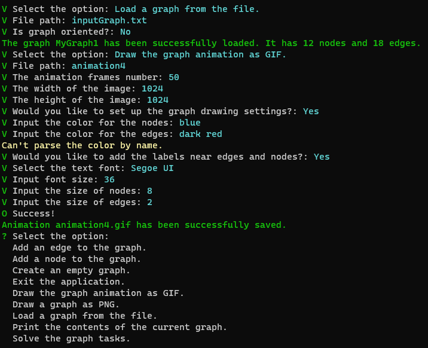

# GraphApp
The CLI interactive oriented graph manager app.

## Features:
* Graph loading, saving and editing
* Creating graph layout images and animations
* Getting the information about graph connectivity

## Graph reading
The application uses nodes list for the graph. You can create the graph, add nodes to it and then add edges. Graphs are oriented, so if you want to used unoriented ones, you need to make backlinks manually.

### Importing graph from the file
The application uses the *Node-Edge lists* format for the files. The file structure looks like this:
1. The list of nodes, each node contain index and name
2. The list of edges, each edge contain index of source, index of destination and name
3. The graph token ends the graph definition. It contain only the name of the graph.

The graph file supports following *tokens* to read:
* `n` for **nodes**
* `e` for **edges**
* `g` for the **graph**
* `#` for comments

Here's [the sample of the graph file](Resources/GraphSample.nel).

## Gallery

